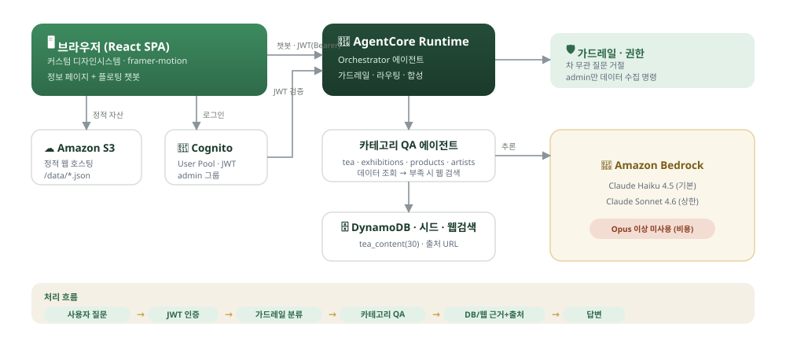

# 🍵 TeaVerse — 차(茶) 정보 제공 WEB 기반 AI Agent 서비스

> **Building Agentic AI with Amazon Bedrock AgentCore** 과정의 **마지막 자유 주제 실습 제출 프로젝트**입니다.
>
> ⚠️ **교육용 프로젝트입니다.** 학습·데모 목적으로 제작되었으며, 챗봇 답변과 시드 데이터(차·전시·상품·작가 정보)는
> AI 생성·샘플 데이터를 포함해 **정확하지 않을 수 있습니다.** 실제 정보로 활용하지 마세요.

차에 대한 전문 정보(전통차·중국차·한국차·꽃차), 전시, 차 도구 상품, 작가 정보를
카테고리별로 제공하고, 어느 페이지에서든 이용 가능한 **플로팅 AI 챗봇**으로
차 관련 질문에 DB/웹 근거와 출처를 곁들여 답변하는 웹 서비스.

📄 프로젝트 결과 리포트: [`docs/PROJECT-REPORT.md`](docs/PROJECT-REPORT.md)

- **프론트엔드**: React + TypeScript (Vite) + 커스텀 디자인 시스템("모던 티 하우스") + framer-motion → S3 정적 호스팅
- **백엔드**: Amazon Bedrock 기반 멀티 에이전트 (로컬 FastAPI → AgentCore 배포)
- **인증**: Amazon Cognito (JWT). 정보 페이지는 공개, 챗봇은 로그인 필요
- **모델 제약**: Claude **Sonnet 4.6 이하만** 사용 (Opus 이상 금지)

> 🌐 **배포**: 어떤 AWS 계정에서도 배포 가능합니다. 배포 후 URL은 `config/project.env`의 `SITE_URL`에 기록됩니다.
> 설정·키 관리는 [`config/README.md`](config/README.md) 참고.

## 아키텍처 개요



브라우저(React SPA)는 S3 정적 호스팅으로 서빙되고, 챗봇은 Cognito JWT로 AgentCore Runtime을
직접 호출한다. Orchestrator가 가드레일 → 카테고리 QA → 근거(DB/웹)+출처 순으로 처리한다.
자세한 내용: `docs/01-PRD.md`, `docs/02-Architecture.md`, `docs/03-Implementation-Plan.md`

## 디렉토리
```
config/     프로젝트 설정(키 관리) — project.env.example (실제값은 gitignore)
docker/     개발 컨테이너(Node/Python/AWS CLI/uv) + 실행 헬퍼
frontend/   React SPA (커스텀 디자인시스템 + framer-motion)
backend/    에이전트 (agentcore/agent.py) + 로컬 FastAPI (app/, agents/, tools/)
data/       차/전시/상품/작가 시드 JSON
infra/      Cognito/DynamoDB/AgentCore/S3 배포 스크립트 + _load_env.sh
scripts/    로컬 실행(run_local.sh), E2E 테스트(e2e_test.sh)
docs/       PRD/아키텍처/구현계획/테스트리포트/배포가이드 + PROJECT-REPORT.md
```

## 빠른 시작
```bash
# 0) 설정 준비 — 실제 값은 config/project.env 에서만 관리(커밋 안 됨)
cp config/project.env.example config/project.env
#    ADMIN_PASSWORD 등 데모 계정 비밀번호를 반드시 변경하세요.

# 1) 개발 컨테이너 기동 (호스트)
cd docker && docker compose up -d

# 2) (최초 1회) Cognito 리소스 생성 — 완료 후 Pool/Client ID가 config에 반영됨
docker exec tea-ai-dev bash -lc 'cd /workspace && bash infra/cognito_setup.sh'
#    출력된 값을 config/project.env 의 COGNITO_* 에 반영

# 3) 프론트+백엔드 로컬 실행
docker exec -it tea-ai-dev bash -lc '/workspace/scripts/run_local.sh'
# 브라우저: http://localhost:5173
```
로그인 계정은 `config/project.env`에 설정한 `ADMIN_*` / `USER1_*` / `USER2_*` 값을 사용합니다.

## 테스트
```bash
docker exec tea-ai-dev bash -lc 'cd /workspace && bash scripts/e2e_test.sh'
```

## 배포
[`docs/05-Deployment-Guide.md`](docs/05-Deployment-Guide.md) 참고. 특정 계정에 종속되지 않으며,
계정 번호는 `aws sts get-caller-identity`로 자동 조회됩니다.
```bash
# 프론트: S3 정적 호스팅
docker exec tea-ai-dev bash -lc 'cd /workspace/frontend && npm run build'
docker exec tea-ai-dev bash -lc 'cd /workspace && bash infra/deploy_s3.sh'
# 데이터/백엔드
docker exec tea-ai-dev bash -lc 'cd /workspace && bash infra/dynamodb_setup.sh'
docker exec tea-ai-dev bash -lc 'cd /workspace && bash infra/agentcore_deploy.sh'
```

## 설정 · 키 관리
특정 계정/리소스/자격증명 값은 [`config/project.env`](config/README.md) 한 곳에서 관리하며
`.gitignore`로 커밋되지 않습니다. 소스·스크립트·문서에는 플레이스홀더만 둡니다.

## 보안 주의
- 비밀/실제 값(`config/project.env`, `pwd.txt`, `.auth/`, `docker/.env`, `*.env.local`,
  `infra/*_output.env`, `infra/*_arn.txt`)은 모두 `.gitignore` 처리되어 커밋되지 않습니다.
- 공개 배포 시 데모 계정 비밀번호를 반드시 강력한 값으로 변경하세요.

## 라이선스
[MIT](LICENSE)
